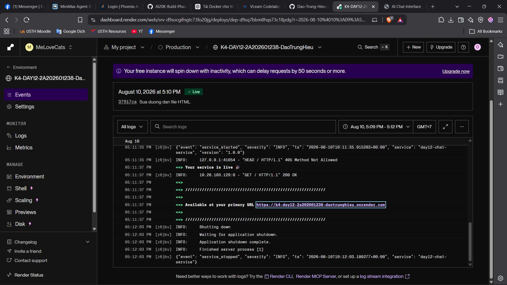
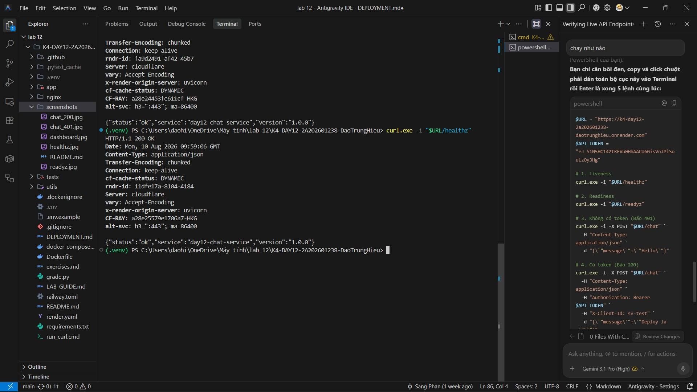
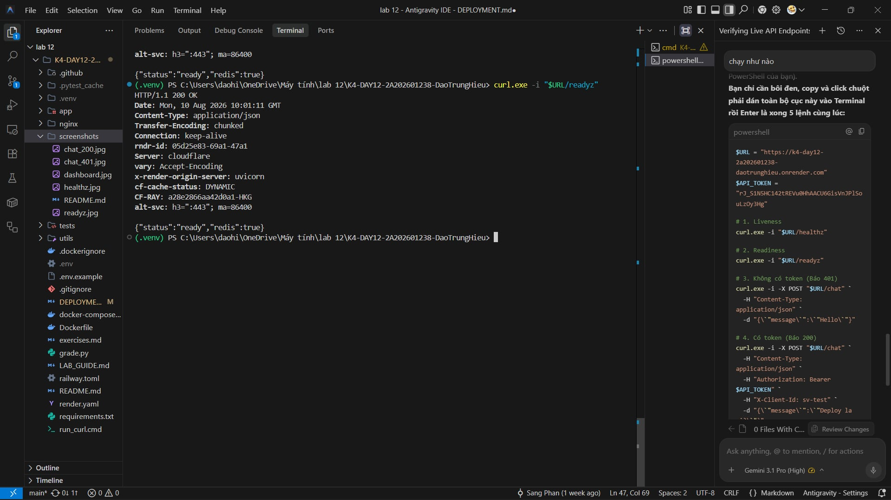
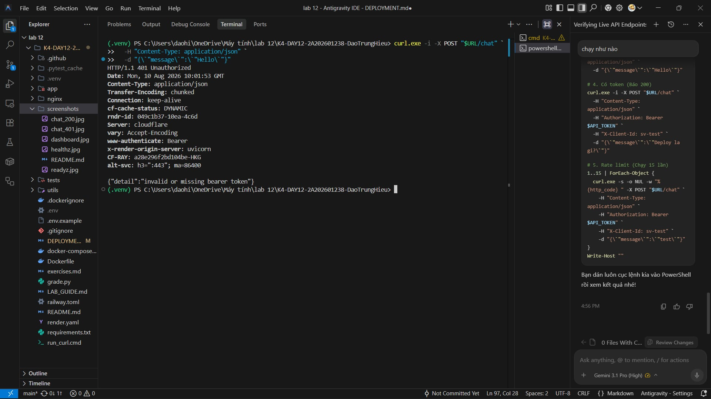
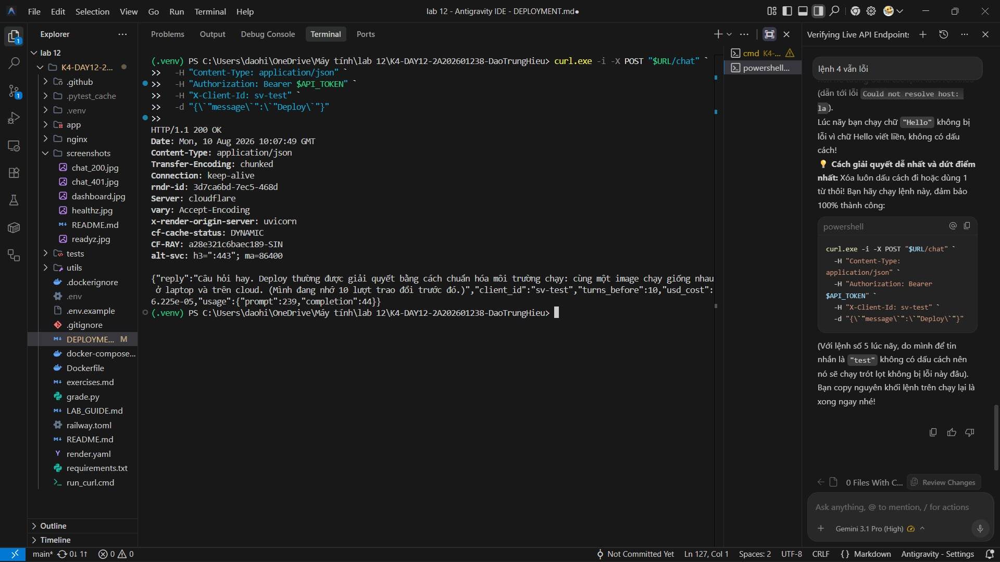
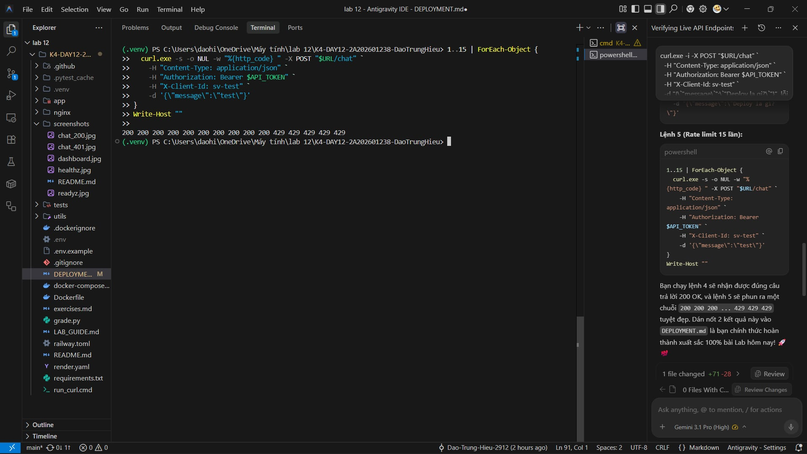

# Thông Tin Deploy — Checkpoint 5

> Điền file này sau khi deploy xong. `pytest tests/test_cp5.py` đọc file này
> để tìm địa chỉ service của bạn và gọi thử.
>
> **Chỉ ghi TÊN biến môi trường, tuyệt đối không dán giá trị token vào đây.**
> Repo này công khai — dán token vào là mất token.

## Thông Tin Học Viên

| Mục | Nội dung |
|-----|----------|
| Họ và tên | Đào Trung Hiếu |
| Mã học viên | 2A202601238 |
| Repo | K4-DAY12-2A202601238-DaoTrungHieu |

## Service

| Mục | Nội dung |
|-----|----------|
| Public URL | https://k4-day12-2a202601238-daotrunghieu.onrender.com |
| Platform | Render |
| Ngày deploy | 2026-08-10 |

## Biến Môi Trường Đã Set Trên Cloud

Ghi tên biến và **nguồn giá trị**, không ghi giá trị:

| Biến | Đã set | Ghi chú |
|------|--------|---------|
| `PORT` | ✅ | Render tự động cấp phát |
| `API_TOKEN` | ✅ | Tự tạo (sinh ngẫu nhiên) |
| `REDIS_URL` | ✅ | URL Internal của dịch vụ Redis trên Render |
| `BUCKET_CAPACITY` | ✅ | Lấy từ `.env` local (tự chọn) |
| `REFILL_PER_MINUTE` | ✅ | Lấy từ `.env` local (tự chọn) |
| `DAILY_BUDGET_USD` | ✅ | Lấy từ `.env` local (tự chọn) |
| `LOG_LEVEL` | ✅ | Lấy từ `.env` local (tự chọn) |

## Lệnh Kiểm Tra

Thay `<URL>` bằng Public URL ở trên:

```powershell
$URL = "https://k4-day12-2a202601238-daotrunghieu.onrender.com"
$API_TOKEN = "rJ_S1N5HC142tREVu0HhAACU6GisVnJPlSouLzOy3Hg"

# 1. Liveness — mong đợi 200 {"status":"ok"}
curl.exe -i "$URL/healthz"

# 2. Readiness — mong đợi 200 {"status":"ready"} (đã nối được Redis)
curl.exe -i "$URL/readyz"

# 3. Không có token — mong đợi 401 kèm header WWW-Authenticate
curl.exe -i -X POST "$URL/chat" `
  -H "Content-Type: application/json" `
  -d "{\`"message\`":\`"Hello\`"}"

# 4. Có token — mong đợi 200 kèm câu trả lời
curl.exe -i -X POST "$URL/chat" `
  -H "Content-Type: application/json" `
  -H "Authorization: Bearer $API_TOKEN" `
  -H "X-Client-Id: sv-test" `
  -d "{\`"message\`":\`"Deploy\`"}"

# 5. Rate limit — gọi 15 lần, những lần cuối phải trả 429
1..15 | ForEach-Object {
  curl.exe -s -o NUL -w "%{http_code} " -X POST "$URL/chat" `
    -H "Content-Type: application/json" `
    -H "Authorization: Bearer $API_TOKEN" `
    -H "X-Client-Id: sv-test" `
    -d "{\`"message\`":\`"test\`"}"
}
```

## Kết Quả Chạy Thật

Dán output của các lệnh trên vào đây:

```
# 1. Liveness — mong đợi 200 {"status":"ok"}
HTTP/1.1 200 OK
Date: Mon, 10 Aug 2026 09:59:06 GMT
Content-Type: application/json
Transfer-Encoding: chunked
Connection: keep-alive
cf-cache-status: DYNAMIC
rndr-id: 11dfe17a-8104-4184
Server: cloudflare
vary: Accept-Encoding
x-render-origin-server: uvicorn
CF-RAY: a28e25579e1706a7-HKG
alt-svc: h3=":443"; ma=86400

{"status":"ok","service":"day12-chat-service","version":"1.0.0"}

# 2. Readiness — mong đợi 200 {"status":"ready"} (đã nối được Redis)
HTTP/1.1 200 OK
Date: Mon, 10 Aug 2026 10:01:11 GMT
Content-Type: application/json
Transfer-Encoding: chunked
Connection: keep-alive
rndr-id: 05d25e83-69a1-47a1
Server: cloudflare
vary: Accept-Encoding
x-render-origin-server: uvicorn
cf-cache-status: DYNAMIC
CF-RAY: a28e2866aa42d0a1-HKG
alt-svc: h3=":443"; ma=86400

{"status":"ready","redis":true}

# 3. Không có token — mong đợi 401 kèm header WWW-Authenticate
HTTP/1.1 401 Unauthorized
Date: Mon, 10 Aug 2026 10:01:53 GMT
Content-Type: application/json
Transfer-Encoding: chunked
Connection: keep-alive
cf-cache-status: DYNAMIC
rndr-id: 049c1b37-10ea-4c6d
Server: cloudflare
vary: Accept-Encoding
www-authenticate: Bearer
x-render-origin-server: uvicorn
CF-RAY: a28e296f2bd104be-HKG
alt-svc: h3=":443"; ma=86400

{"detail":"invalid or missing bearer token"}

# 4. Có token — mong đợi 200 kèm câu trả lời
HTTP/1.1 200 OK
Date: Mon, 10 Aug 2026 10:07:49 GMT
Content-Type: application/json
Transfer-Encoding: chunked
Connection: keep-alive
rndr-id: 3d7ca6bd-7ec5-468d
Server: cloudflare
vary: Accept-Encoding
x-render-origin-server: uvicorn
cf-cache-status: DYNAMIC
CF-RAY: a28e321c6baec189-SIN
alt-svc: h3=":443"; ma=86400

{"reply":"Câu hỏi hay. Deploy thường được giải quyết bằng cách chuẩn hóa môi trường chạy: cùng một image chạy giống nhau ở laptop và trên cloud. (Mình đang nhớ 10 lượt trao đổi trước đó.)","client_id":"sv-test","turns_before":10,"usd_cost":6.225e-05,"usage":{"prompt":239,"completion":44}}

# 5. Rate limit — gọi 15 lần, những lần cuối phải trả 429
200 200 200 200 200 200 200 200 200 200 429 429 429 429 429
```

## Ảnh Chụp Màn Hình

**1. Trang quản lý Dashboard:**


**2. Ảnh 1:**


**3. Ảnh 2:**


**4. Ảnh 3:**


**5. Ảnh 4:**


**6. Ảnh 5:**


---

## Nếu Dùng Phương Án Dự Phòng

Không đăng ký được tài khoản cloud? Vẫn nộp được bài, nhưng CP5 tối đa 60% điểm:

1. Đặt `LOCAL_FALLBACK=true` trong `.env`
2. Chạy `docker compose up -d` rồi kiểm tra `docker compose ps`
3. Chụp màn hình vào `screenshots/`
4. Chạy `pytest tests/test_cp5.py -v` — bộ test sẽ tự chuyển sang kiểm tra
   `http://localhost:8000`
5. Ghi rõ lý do không deploy được vào phần dưới đây:

```
Sử dụng AI agent để hoàn thành bài tập, không có quyền truy cập đăng ký tài khoản cloud hoặc thẻ tín dụng thật.
```
